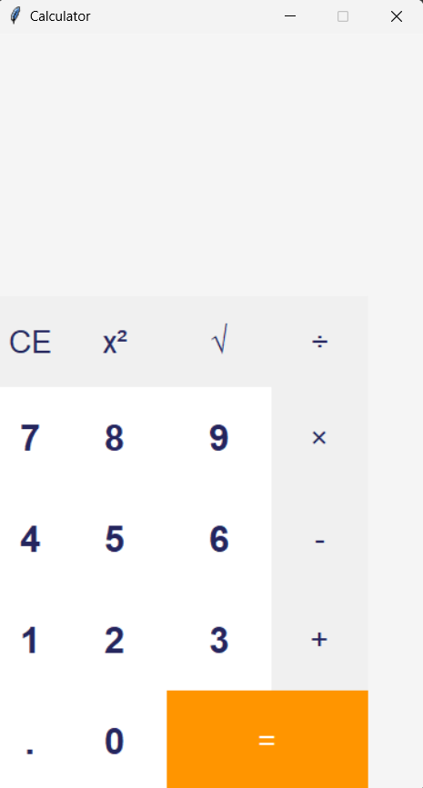

# PyCalculator

A simple calculator built using Python and Tkinter, providing basic arithmetic operations and square root functionality.



## Table of Contents
- [Introduction](#introduction)
- [Features](#features)
- [Requirements](#requirements)
- [Installation](#installation)
- [Usage](#usage)
- [Keyboard Shortcuts](#keyboard-shortcuts)
- [License](#license)

## Introduction

This calculator application is built using Python and Tkinter, a standard GUI toolkit for Python. It provides a user-friendly interface to perform basic arithmetic operations like addition, subtraction, multiplication, and division. Additionally, the calculator also supports square and square root calculations.

The project showcases how to create a simple calculator using object-oriented programming and Tkinter's graphical elements.

## Features

- Addition, subtraction, multiplication, and division operations
- Square and square root calculations
- Error handling for invalid expressions and division by zero
- Keyboard support for entering digits and operators

## Requirements

- Python 3.x
- Tkinter (usually comes pre-installed with Python)

## Installation

1. Clone the repository to your local machine:

   ```
   git clone https://github.com/your-username/calculator.git
   ```

2. Navigate to the project directory:

   ```
   cd calculator
   ```

## Usage

To run the calculator, execute the following command in the terminal:

```
python calculator.py
```

The graphical user interface (GUI) of the calculator will open, allowing you to perform arithmetic calculations easily.

## Keyboard Shortcuts

The calculator supports keyboard shortcuts for quick input:

- Digits (0-9): Enter the desired digits to build the expression.
- Decimal Point (.): Use the decimal point for floating-point numbers.
- Operators (+, -, *, /): Press the corresponding keys to perform arithmetic operations.
- Enter/Return: Evaluate the expression.
- Esc: Clear the current expression.

## License

This project is licensed under the MIT License - see the [LICENSE](LICENSE) file for details.